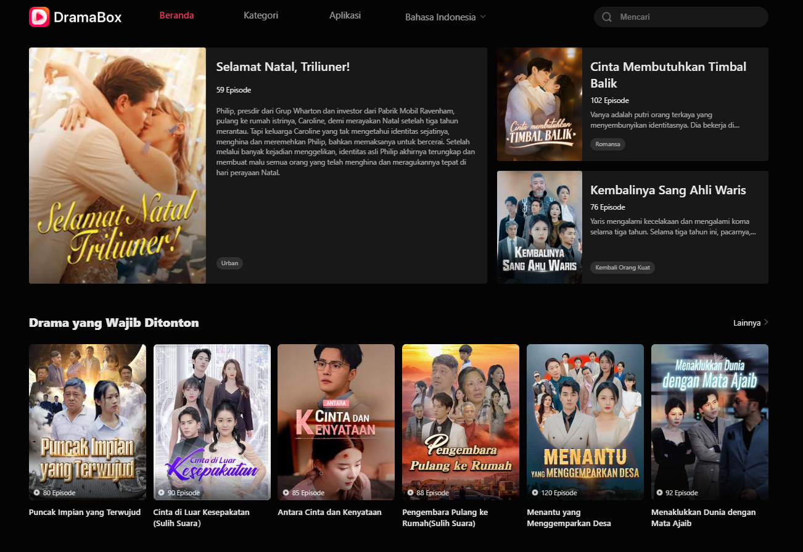

# 🚀 API SERVER DRAMABOX

Api server sederhana untuk mengambil data scraper video dari dramabox
mungkin akan berguna bagi kalian.

## 🌟 Fitur

- ✅ Fitur 1: Searching Video With Title
- ✅ Fitur 2: Scrapping Video By Title
- ✅ Fitur 3: Auto Generate Signature & Full bypass

## Contoh Web Target

<center></center>

## 📦 Example Api Server cURL

Langkah-langkah untuk menginstal dan menjalankan proyek ini di mesin lokal Anda.
Atau mau di server kalian juga boleh hhe.

1. Contoh function search: `getting title video`
```php
// function search untuk menemukan judul film yang akan kalian cari.
// string keyword bisa anda ubah semau kalian.

 $body = json_encode([
  'type' => 'search',
  'keyword' => 'CEO',
]);

echo restAPI::seach();
```


2. Contoh function getVideo: `getting all path video`
```php
// function getVideo untuk mengambil data path URL video all sudah otomatis bypass signature.
// string requestID hasil dari data function search sialhkan masukan ke dalam function getVideo

$body = json_encode([
  'type' => 'video',
  'requestID' => '41000119793'
]);

echo restAPI::getVideo();
```
Silahkan kembangkan lagi sesuka kalian.
Jika berguna api server nya silahkan follow akun github nya ya wkwkwk.

# Note
The script runs with the license key,
if you don't have a license key then you can't run it,
to get a license key you have to ask the creator for its activation for a donation of course,
This script blocks multiple user logins so that the script remains safe and secure.

Regards,
**Iddant ID**

