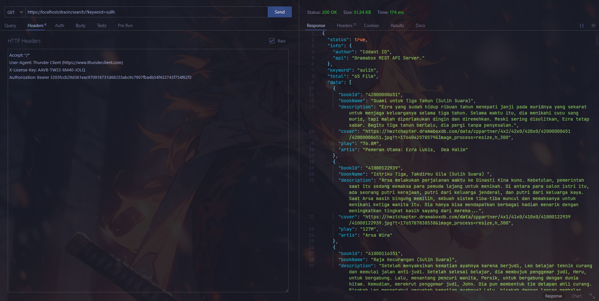
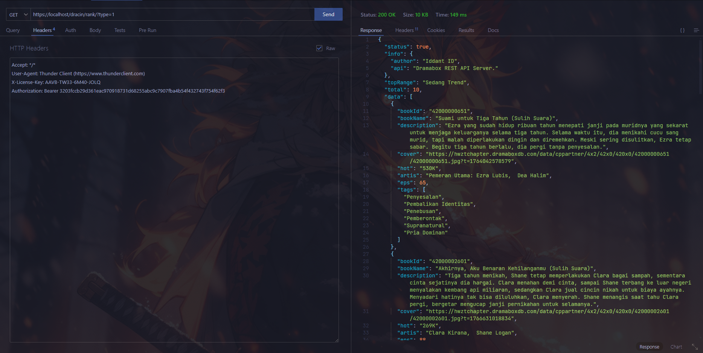
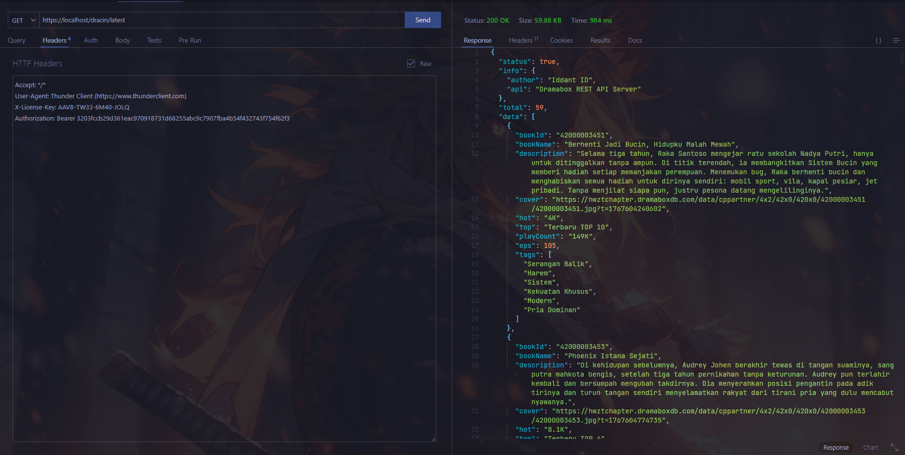

<p align="center">
  
</p>

<h1 align="center">🚀 Dramabox API Server</h1>

<p align="center">
  <b>Simple & Secure API Server for Dramabox Video Scraper</b>
</p>

<p align="center">
  
  
  
  
</p>

---

## 📌 Deskripsi

**Dramabox API Server** adalah API sederhana untuk mengambil data **video, ranking, update terbaru, dan episode** dari hasil scraping Dramabox.

Cocok digunakan untuk:
- Backend aplikasi streaming
- Data eksperimen & riset
- Project pembelajaran REST API
- Integrasi ke web / mobile app

---

## ✨ Fitur

- 🔍 Search Video by Keyword  
- 📊 Top Popular Rank  
- 🆕 Latest Update Video  
- 🎬 Get All Episode by ID  
- 🔐 License Key Protection  

---

## 🌐 Preview

### 🔍 Search Video
<p align="center">
  
</p>

### 📈 Top Rank
<p align="center">
  
</p>

### 🆕 Latest Update
<p align="center">
  
</p>

---

## 📦 API Endpoint Examples (cURL)
```php
API_TOKEN  : 3203fccb29d361eac970918731d68255abc9c7907fba4b54f432743f754f62f3
LICENSE_KEY: AAVB-TW33-6M40-JOLQ

```

### 🔍 Search Video
```bash
curl -X GET "https://zmailx.online/dracin/search/?keyword=sulih suara" \
 -H "Authorization: Bearer YOUR_API_TOKEN" \
 -H "X-License-Key: YOUR_LICENSE_KEY"
```

### 📊 Get Top Popular Rank Video
```bash
curl -X GET "https://zmailx.online/dracin/rank/?type=1" \
 -H "Authorization: Bearer YOUR_API_TOKEN" \
 -H "X-License-Key: YOUR_LICENSE_KEY"
```

### 🆕 Get Latest Video
```bash
curl -X GET "https://zmailx.online/dracin/latest" \
 -H "Authorization: Bearer YOUR_API_TOKEN" \
 -H "X-License-Key: YOUR_LICENSE_KEY"
```

### 🎬 Get All Episode Video
```bash
curl -X GET "https://zmailx.online/dracin/{bookId}/episode" \
 -H "Authorization: Bearer YOUR_API_TOKEN" \
 -H "X-License-Key: YOUR_LICENSE_KEY"
```

### 🔐 License System
- Script tidak dapat dijalankan tanpa License Key
- License Key bersifat private & terikat user
- Untuk mendapatkan License Key, silakan hubungi creator
(Activation via donation)

###  🚀 Pengembangan

Silakan:
- Fork 🍴
- Modifikasi ✍️
- Kembangkan sesuai kebutuhan 🤝<br>
Jika API ini bermanfaat, jangan lupa ⭐ Star & Follow GitHub creator-nya 😄

### ⚠️ Disclaimer
Project ini dibuat untuk tujuan edukasi & eksperimen.
Segala bentuk penyalahgunaan berada di luar tanggung jawab developer.


Silahkan kembangkan lagi sesuka kalian.<br>
Jika berguna api server nya silahkan follow akun github nya ya wkwkwk.

# Note
The script runs with the license key,
if you don't have a license key then you can't run it,
to get a license key you have to ask the creator for its activation for a donation of course,
This script blocks multiple user logins so that the script remains safe and secure.

Regards,
**Iddant ID**

